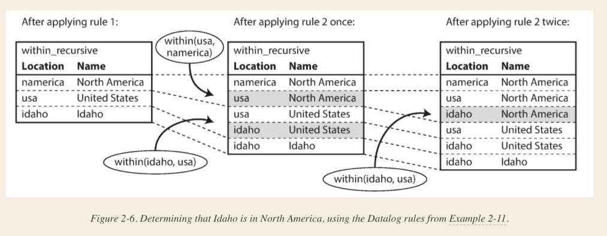

# Designing Data Intensive Applications

### 1. Reliable, Scalable, and Maintainable Applications

### 2. Data Models and Query Languages

##### NoSql _Not only Sql_

Driving forces for NoSql adoption

1. Greater Scalability and higher write throughput
2. Free Open Source over Commercial databases
3. Specialized Query operations not supported by relational
4. Restrictiveness of the relational schemas

Relational databases likely continue to be used alongside a broad variety of non-relational datastores—an idea that is
sometimes called *polyglot persistence*

##### Object Relational Mismatch (*impedence mismatch*)


Json Representation is good for locality one to many relations imply a tree structure which it captures well

```json
{
  "user_id": 251,
  "first_name": "Bill",
  "last_name": "Gates",
  "summary": "Co-chair of the Bill & Melinda Gates... Active blogger.",
  "region_id": "us:91",
  "industry_id": 131,
  "photo_url": "/p/7/000/253/05b/308dd6e.jpg",
  "positions": [
    {
      "job_title": "Co-chair",
      "organization": "Bill & Melinda Gates Foundation"
    },
    {
      "job_title": "Co-founder, Chairman",
      "organization": "Microsoft"
    }
  ],
  "education": [
    {
      "school_name": "Harvard University",
      "start": 1973,
      "end": 1975
    },
    {
      "school_name": "Lakeside School, Seattle",
      "start": null,
      "end": null
    }
  ],
  "contact_info": {
    "blog": "http://thegatesnotes.com",
    "twitter": "http://twitter.com/BillGates"
  }
}
```


Feature | NoSql | Relational
------------ | ------------- | -------------
locality <br> (one to many) | Easier to access relations (one to many relations) | Requires queries
many to one | Application Code emulates join by multiple queries| Supports joins
many To many | joins are not inherently supported | Supports Join

*Heirarchical Model* : Similar to Json Nested Tree of records is Used by IBM's Information Management System. IMS used
in 1970's. Like document databases, IMS worked well for one-to-many relationships, but it made many-to-many
relationships difficult, and it didn’t support joins. Developers had to decide whether to duplicate (denormalize) data
or to manually resolve references from one record to another

*Solution: Relational Model and Network model*

*Network Model* :  In the tree structure of the hierarchical model, every record has exactly one parent; in the network
model, a record could have multiple parents. For example, there could be one record for the "Greater Seattle Area"
region, and every user who lived in that region could be linked to it. The only way of accessing a record was to follow
a path from a root record along these chains of links. This was called an **access path**.
<p> 
Problem is with many to one and many to many a record will have multiple access paths and
Changing application data model became hard . It required making changes to database query/update code
to modify the access paths
</p>

*Relation Model*: Simple collection of tuples. Can read/update/add any row. In a relational database, the query
optimizer automatically decides which parts of the query to execute in which order, and which indexes to use. Those
choices are effectively the “access path,” but the big difference is that they are made automatically by the query
optimizer, not by the application developer.

* Document Databases - Schema on Read (similar to dynamic programming language runtime checks)
* Relational Databases - Schema on Write (similar to compile time checking of static language )

Go For Document databases when

* There are many different types of objects, and it is not practicable to put each type of object in its own table.
* The structure of the data is determined by external systems over which you have no control and which may change at any
  time.

Locality Features in Relational:

* Google Spanner allows nested tables under a parent table
* Oracle allows multi-table index cluster tables
* Bigtable has *Column family*

#### Query Languages

Declarative vs Imperative

Imperative

```
function getSharks() {
    var sharks = [];
    for (var i = 0; i < animals.length; i++) {
        if (animals[i].family === "Sharks") {
            sharks.push(animals[i]);
        }
    }
    return sharks;
}
```

Declarative: sharks = σfamily = “Sharks” (animals)

```
SELECT * FROM animals WHERE family = 'Sharks';
```

#### Graph Like Data Models


##### Property Graphs

In the property graph model, each vertex consists of:

* A unique identifier

* A set of outgoing edges

* A set of incoming edges

* A collection of properties (key-value pairs)

Each edge consists of:

* A unique identifier

* The vertex at which the edge starts (the tail vertex)

* The vertex at which the edge ends (the head vertex)

* A label to describe the kind of relationship between the two vertices

* A collection of properties (key-value pairs)

```
CREATE TABLE vertices (
    vertex_id   integer PRIMARY KEY,
    properties  json
);

CREATE TABLE edges (
    edge_id     integer PRIMARY KEY,
    tail_vertex integer REFERENCES vertices (vertex_id),
    head_vertex integer REFERENCES vertices (vertex_id),
    label       text,
    properties  json
);

CREATE INDEX edges_tails ON edges (tail_vertex);
CREATE INDEX edges_heads ON edges (head_vertex);
```

##### Cypher Query Language

```
CREATE
  (NAmerica:Location {name:'North America', type:'continent'}),
  (USA:Location      {name:'United States', type:'country'  }),
  (Idaho:Location    {name:'Idaho',         type:'state'    }),
  (Lucy:Person       {name:'Lucy' }),
  (Idaho) -[:WITHIN]->  (USA)  -[:WITHIN]-> (NAmerica),
  (Lucy)  -[:BORN_IN]-> (Idaho)
  ```

_Cypher query to find people who emigrated from the US to Europe_

```
MATCH  
(person) -[:BORN_IN]->  () -[:WITHIN*0..]-> (us:Location {name:'United States'}), 
(person) -[:LIVES_IN]-> () -[:WITHIN*0..]-> (eu:Location {name:'Europe'})
RETURN person.name
```

Using SQL's _recursive common table expressions_

```
WITH RECURSIVE

  -- in_usa is the set of vertex IDs of all locations within the United States
  in_usa(vertex_id) AS (
      SELECT vertex_id FROM vertices WHERE properties->>'name' = 'United States' 1
    UNION
      SELECT edges.tail_vertex FROM edges 2
        JOIN in_usa ON edges.head_vertex = in_usa.vertex_id
        WHERE edges.label = 'within'
  ),

  -- in_europe is the set of vertex IDs of all locations within Europe
  in_europe(vertex_id) AS (
      SELECT vertex_id FROM vertices WHERE properties->>'name' = 'Europe' 3
    UNION
      SELECT edges.tail_vertex FROM edges
        JOIN in_europe ON edges.head_vertex = in_europe.vertex_id
        WHERE edges.label = 'within'
  ),

  -- born_in_usa is the set of vertex IDs of all people born in the US
  born_in_usa(vertex_id) AS ( 4
    SELECT edges.tail_vertex FROM edges
      JOIN in_usa ON edges.head_vertex = in_usa.vertex_id
      WHERE edges.label = 'born_in'
  ),

  -- lives_in_europe is the set of vertex IDs of all people living in Europe
  lives_in_europe(vertex_id) AS ( 5
    SELECT edges.tail_vertex FROM edges
      JOIN in_europe ON edges.head_vertex = in_europe.vertex_id
      WHERE edges.label = 'lives_in'
  )

SELECT vertices.properties->>'name'
FROM vertices
-- join to find those people who were both born in the US *and* live in Europe
JOIN born_in_usa     ON vertices.vertex_id = born_in_usa.vertex_id 6
JOIN lives_in_europe ON vertices.vertex_id = lives_in_europe.vertex_id;
```

#### Triple-Stores and SPARQL

Similar to Property Graphs

In a triple-store, all information is stored in the form of very simple three-part statements: (subject, predicate,
object). For example, in the triple (Jim, likes, bananas), Jim is the subject, likes is the predicate (verb), and
bananas is the object.

The subject of a triple is equivalent to a vertex in a graph. The object is one of two things:

* A value in a primitive datatype, such as a string or a number. In that case, the predicate and object of the triple
  are equivalent to the key and value of a property on the subject vertex. For example, (lucy, age, 33) is like a vertex
  lucy with properties {"age":33}.


* Another vertex in the graph. In that case, the predicate is an edge in the graph, the subject is the tail vertex, and
  the object is the head vertex. For example, in (lucy, marriedTo, alain) the subject and object lucy and alain are both
  vertices, and the predicate marriedTo is the label of the edge that connects them.

```
@prefix : <urn:example:>.
_:lucy     a       :Person.
_:lucy     :name   "Lucy".
_:lucy     :bornIn _:idaho.
_:idaho    a       :Location.
_:idaho    :name   "Idaho".
_:idaho    :type   "state".
_:idaho    :within _:usa.
_:usa      a       :Location.
_:usa      :name   "United States".
_:usa      :type   "country".
_:usa      :within _:namerica.
_:namerica a       :Location.
_:namerica :name   "North America".
_:namerica :type   "continent".

-- A more concise way

@prefix : <urn:example:>.
_:lucy     a :Person;   :name "Lucy";          :bornIn _:idaho.
_:idaho    a :Location; :name "Idaho";         :type "state";   :within _:usa.
_:usa      a :Location; :name "United States"; :type "country"; :within _:namerica.
_:namerica a :Location; :name "North America"; :type "continent".
```

#### The SEMANTIC WEB

The semantic web is fundamentally a simple and reasonable idea: websites already publish information as text and pictures
for humans to read, so why don’t they also publish information as machine-readable data for computers to read? The
Resource Description Framework (RDF) was intended as a mechanism for different websites to publish data in a
consistent format, allowing data from different websites to be automatically combined into a web of data—a kind of
internet-wide “database of everything.”

RDF/XML
```xml
<rdf:RDF xmlns="urn:example:"
    xmlns:rdf="http://www.w3.org/1999/02/22-rdf-syntax-ns#">

  <Location rdf:nodeID="idaho">
    <name>Idaho</name>
    <type>state</type>
    <within>
      <Location rdf:nodeID="usa">
        <name>United States</name>
        <type>country</type>
        <within>
          <Location rdf:nodeID="namerica">
            <name>North America</name>
            <type>continent</type>
          </Location>
        </within>
      </Location>
    </within>
  </Location>

  <Person rdf:nodeID="lucy">
    <name>Lucy</name>
    <bornIn rdf:nodeID="idaho"/>
  </Person>
</rdf:RDF>
```
#### The Foundation: Datalog
Representation
```
name(namerica, 'North America').
type(namerica, continent).

name(usa, 'United States').
type(usa, country).
within(usa, namerica).

name(idaho, 'Idaho').
type(idaho, state).
within(idaho, usa).

name(lucy, 'Lucy').
born_in(lucy, idaho).
```

Query
(Prolog syntax)
```
within_recursive(Location, Name) :- name(Location, Name).     /* Rule 1 */

within_recursive(Location, Name) :- within(Location, Via),    /* Rule 2 */
                                    within_recursive(Via, Name).

migrated(Name, BornIn, LivingIn) :- name(Person, Name),       /* Rule 3 */
                                    born_in(Person, BornLoc),
                                    within_recursive(BornLoc, BornIn),
                                    lives_in(Person, LivingLoc),
                                    within_recursive(LivingLoc, LivingIn).

?- migrated(Who, 'United States', 'Europe').
/* Who = 'Lucy'. */
```
